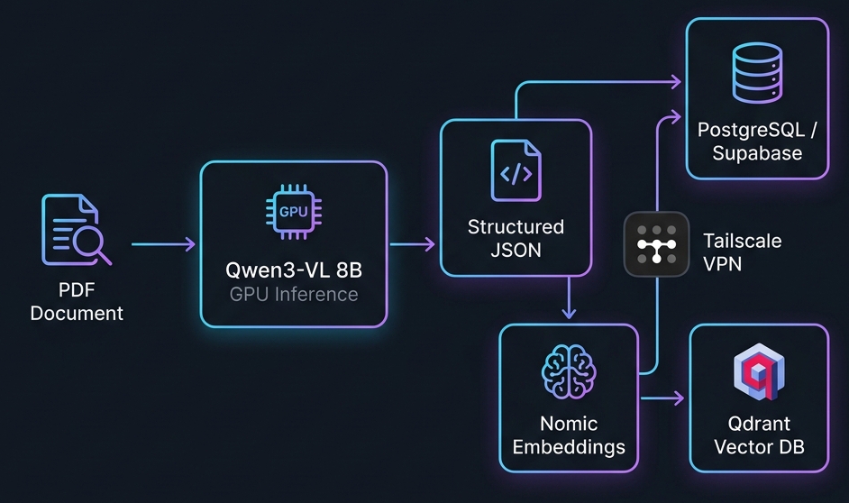

<p align="center">
  
</p>

<h1 align="center">📄 VLM Document Intelligence Pipeline</h1>

<p align="center">
  <em>GPU-accelerated, vision-language extraction engine that transforms raw PDF documents into semantically indexed, search-ready structured data — powered by on-device multimodal AI.</em>
</p>

<p align="center">
  
  
  
  
  
  
</p>

---

## 🎯 Overview

This project implements a **production-grade document extraction pipeline** that uses a **Vision-Language Model (VLM)** to perform high-fidelity OCR and semantic structuring of academic PDF documents — entirely on-device, without relying on external API services like OpenAI or Google Cloud Vision.

The pipeline renders each PDF page as an image, feeds it to a locally-hosted **Qwen3-VL 8B** model for structured JSON extraction, validates the output against a strict hallucination-prevention schema, generates dense vector embeddings via **Nomic Embed**, and persists the results into both a relational database (PostgreSQL/Supabase) and a vector database (Qdrant) for downstream semantic search.

> **Why does this matter?** Traditional OCR tools (Tesseract, Adobe) lose structural context — headings, subtopics, chapter boundaries, and content categorization are discarded. This pipeline preserves the full semantic hierarchy of a document, making it directly queryable by AI-powered search and retrieval-augmented generation (RAG) systems.

---

## ✨ Key Features

| Capability | Description |
|:---|:---|
| **🧠 Multimodal Vision Extraction** | Leverages Qwen3-VL 8B (Q8_0 quantized, 8.2 GB) for pixel-level understanding — no traditional OCR dependency |
| **🛡️ Anti-Hallucination Engine** | Multi-layer validation loop with explicit chapter syllabus injection, retry-with-feedback, and stateful chapter-tracking to prevent model confabulation |
| **🔗 Cross-Page Stitching** | Three-signal continuation detection (VLM vote + heuristic analysis + semantic cosine similarity arbiter) to seamlessly merge content split across page boundaries |
| **📐 Structured JSON Schema** | Enforced output schema with chapter metadata, topic/subtopic hierarchy, content categorization (objective/subjective/numerical), and LaTeX math preservation |
| **🗄️ Dual-Database Persistence** | Simultaneous writes to PostgreSQL (raw structured data) and Qdrant (768-dim dense vectors) with idempotent upserts |
| **🔄 Crash-Resilient State Machine** | Per-resource processing state persisted to PostgreSQL — pipeline resumes from the exact page after any interruption |
| **📝 MCQ Resolution Engine** | Batched multiple-choice question resolution against extracted answer keys using VLM-powered answer matching |
| **🌐 Zero-Trust Networking** | Tailscale mesh VPN with SOCKS5 TCP bridge for secure database connectivity from ephemeral cloud runtimes |
| **⚡ GPU-Optimized Inference** | Full GPU offload (`n_gpu_layers=-1`), Flash Attention, 8K context window, thread-safe concurrent request handling |

---

## 🏗️ Architecture

```
┌─────────────────────────────────────────────────────────────────────────┐
│                        Google Colab Runtime (T4 GPU)                   │
│                                                                        │
│  ┌──────────────┐    ┌──────────────────────────────────────────────┐  │
│  │  PDF Source   │───▶│  FastAPI Inference Server (:9090)            │  │
│  │  (pypdfium2)  │    │                                              │  │
│  │  200 DPI JPEG │    │  ┌─────────────────┐  ┌──────────────────┐  │  │
│  └──────────────┘    │  │  Qwen3-VL 8B    │  │  Nomic Embed     │  │  │
│                       │  │  (Vision + JSON) │  │  (768-dim dense) │  │  │
│                       │  │  /v1/chat/comp.  │  │  /v1/embeddings  │  │  │
│                       │  └────────┬────────┘  └────────┬─────────┘  │  │
│                       └───────────┼─────────────────────┼────────────┘  │
│                                   │                     │               │
│  ┌────────────────────────────────┼─────────────────────┼────────────┐  │
│  │         VLM Pipeline Engine    │                     │            │  │
│  │                                ▼                     ▼            │  │
│  │  ┌──────────────┐   ┌──────────────┐   ┌──────────────────────┐  │  │
│  │  │ Hallucination│   │  Cross-Page   │   │  Semantic Embedding  │  │  │
│  │  │  Validator   │   │  Stitcher     │   │  + Vector Upsert     │  │  │
│  │  └──────┬───────┘   └──────┬───────┘   └──────────┬───────────┘  │  │
│  │         │                  │                       │              │  │
│  │         ▼                  ▼                       ▼              │  │
│  │  ┌─────────────────────────────────────────────────────────────┐  │  │
│  │  │              State Machine (processing_state)               │  │  │
│  │  │  Tracks: last_page, active_buffer, tail_text, pending_mcqs  │  │  │
│  │  └─────────────────────────────────────────────────────────────┘  │  │
│  └───────────────────────────────────────────────────────────────────┘  │
│                                                                        │
│  ┌──────────────────┐                                                  │
│  │  Tailscale VPN   │─── SOCKS5 Bridge ──┐                            │
│  │  (Mesh Network)  │                     │                            │
│  └──────────────────┘                     │                            │
└───────────────────────────────────────────┼────────────────────────────┘
                                            │
                    ┌───────────────────────┐│┌───────────────────────┐
                    │   PostgreSQL          │││   Qdrant Vector DB    │
                    │   (Supabase)          ◀┘▶   (Self-Hosted)       │
                    │                       │ │                       │
                    │  • raw_extracted_     │ │  • 768-dim vectors    │
                    │    subtopics          │ │  • Filtered semantic  │
                    │  • processing_state   │ │    search by chapter, │
                    │  • resource_meta      │ │    subject, board     │
                    └───────────────────────┘ └───────────────────────┘
```

---

## 🔬 Technical Deep Dive

### Hallucination Prevention System

One of the core engineering challenges with VLM-based extraction is **model confabulation** — the model inventing chapter numbers, fabricating topic names, or silently drifting from the correct chapter context across pages. This pipeline implements a **5-layer defense**:

1. **Explicit Syllabus Injection** — The complete chapter-to-number mapping is injected into every VLM prompt as a mandatory constraint, restricting the model's output vocabulary.

2. **Stateful Chapter Tracking** — The pipeline maintains `current_chapter_name` and `current_chapter_number` across pages, providing the model with explicit context about what chapter it *should* be in.

3. **Bidirectional Consistency Validation** — After each VLM response, the validator checks that name and number changes are symmetrical (both change or neither change), preventing partial hallucinations.

4. **Title Page Gate** — The `is_new_chapter_start` flag is cross-validated: if the chapter changed, the flag *must* be true; if the flag is true, the chapter *must* have changed. Violations trigger a retry with corrective feedback.

5. **Retry-with-Feedback Loop** — Failed validations don't silently discard data. Instead, the exact error is fed back to the VLM as an additional user message, giving the model a chance to self-correct (up to 5 attempts).

### Cross-Page Content Stitching

Academic documents frequently split paragraphs, equations, and question blocks across page boundaries. Naïve per-page extraction would fragment these into incomplete, unsearchable chunks. The pipeline uses a **three-signal voting system**:

| Signal | Method | Strength |
|:---|:---|:---|
| **VLM Vote** | The model's own `is_continuation_from_previous_page` field | High confidence, but can hallucinate |
| **Heuristic Vote** | Checks if the previous page's last chunk ends mid-sentence (trailing alphanumeric, comma, semicolon, or hyphen) | Fast, deterministic, but context-blind |
| **Semantic Arbiter** | Computes cosine similarity between the last 50 words of the previous page and the first 50 words of the current page using Nomic embeddings (threshold: 0.59) | Highest accuracy, used as tiebreaker |

When VLM and Heuristic agree, their consensus is used. When they disagree, the Semantic Arbiter is invoked as the final decision-maker.

### MCQ Resolution Engine

The pipeline implements a **deferred resolution strategy** for multiple-choice questions:

1. MCQs are detected by their `content_category: "objective"` classification and buffered in `pending_mcqs`.
2. When an answer key block is detected (`is_answer_key: true`), the buffered MCQs are sent to the VLM in batches (max 15 per batch, grouped by topic).
3. The VLM cross-references each MCQ against the answer key and appends `**Correct Answer:** [option]` to each question's text.
4. Resolved MCQs are then persisted to both databases with their answers attached.

---

## 🛠️ Tech Stack

| Layer | Technology | Purpose |
|:---|:---|:---|
| **Vision Model** | [Qwen3-VL 8B](https://huggingface.co/Qwen/Qwen3-VL-8B-Instruct) (Q8_0 GGUF) | Multimodal page-to-JSON extraction |
| **Embedding Model** | [Nomic Embed Text v1.5](https://huggingface.co/nomic-ai/nomic-embed-text-v1.5) (Q8_0 GGUF) | 768-dimensional dense vector generation |
| **Inference Runtime** | [llama-cpp-python](https://github.com/abetlen/llama-cpp-python) v0.3.44 | CUDA-accelerated GGUF inference with Flash Attention |
| **API Server** | [FastAPI](https://fastapi.tiangolo.com/) + [Uvicorn](https://www.uvicorn.org/) | OpenAI-compatible `/v1/chat/completions` and `/v1/embeddings` endpoints |
| **PDF Rendering** | [pypdfium2](https://github.com/AcidComet/pypdfium2) | High-fidelity 200 DPI page-to-image rasterization |
| **Relational DB** | [PostgreSQL](https://www.postgresql.org/) via [Supabase](https://supabase.com/) | Structured data storage, processing state, idempotent upserts |
| **Vector DB** | [Qdrant](https://qdrant.tech/) | Filtered semantic search with chapter/subject/board metadata |
| **Networking** | [Tailscale](https://tailscale.com/) + SOCKS5 TCP Bridge | Zero-trust mesh VPN for secure cross-network database access |
| **Compute** | Google Colab (NVIDIA T4 GPU) | Free-tier GPU for model inference |

---

## 📦 Output Schema

Each extracted page produces a structured JSON object:

```json
{
  "page_chapter_number": 10,
  "page_chapter_name": "thermal physics",
  "is_new_chapter_start": false,
  "chunks": [
    {
      "topic_name": "thermal expansion",
      "subtopic_name": "linear & volumetric expansion",
      "content_category": "subjective",
      "is_answer_key": false,
      "text": "**Thermal Expansion**\nWhen a substance is heated, its particles vibrate more vigorously...",
      "continues_on_next_page": false,
      "is_continuation_from_previous_page": false
    }
  ]
}
```

### Vector Payload (Qdrant)

Each chunk is embedded and stored with rich metadata for filtered retrieval:

```json
{
  "id": "uuid-v5-deterministic",
  "vector": [0.0234, -0.0891, ...],
  "payload": {
    "resource_id": "uuid",
    "class_level": "10",
    "subject_slug": "physics",
    "board_slug": "fbise",
    "medium": "english",
    "resource_type": "notes",
    "chapter_number": 10,
    "chapter_name": "thermal physics",
    "topic_name": "thermal expansion",
    "subtopic_name": "linear & volumetric expansion",
    "content_category": "subjective",
    "text_content": "full extracted text...",
    "page_number": 42,
    "timestamp": 1787122775
  }
}
```

---

## 🚀 Quick Start

### Prerequisites

- Google Colab account with GPU runtime (T4 or higher)
- Google Drive with model weights (see below)
- Tailscale account with auth key
- Self-hosted PostgreSQL (Supabase) and Qdrant instances

### Model Weights

Download and place in `Google Drive > MyDrive > VLM_Engine/`:

| File | Size | Source |
|:---|:---|:---|
| `Qwen3VL-8B-Instruct-Q8_0.gguf` | 8.2 GB | [HuggingFace](https://huggingface.co/Qwen/Qwen3-VL-8B-Instruct-GGUF) |
| `mmproj-Qwen3VL-8B-Instruct-F16.gguf` | 1.1 GB | Vision projector (bundled with model) |
| `nomic-embed-text-v1.5.Q8_0.gguf` | 140 MB | [HuggingFace](https://huggingface.co/nomic-ai/nomic-embed-text-v1.5-GGUF) |

### Colab Secrets

Configure the following in Colab's Secrets manager (`🔑` icon):

| Secret Key | Description |
|:---|:---|
| `tail-auth-key` | Tailscale authentication key |
| `lattitude_ip` | Tailscale IP of the Supabase PostgreSQL host |
| `orc_ip` | Tailscale IP of the Qdrant host |
| `supabase_pass` | PostgreSQL password |
| `qdrant-key` | Qdrant API key |
| `database_url` | Full PostgreSQL connection string for the remote catalog DB |

### Execution

Open the notebook in Google Colab and run cells sequentially:

1. **Cell 1** — Mount Google Drive & validate PDF file
2. **Cell 2** — Install Tailscale & establish VPN mesh
3. **Cell 3** — Configure database connections & health checks
4. **Cell 4** — Restore pre-compiled `llama-cpp-python` from Drive
5. **Cell 5** — Write the FastAPI multi-model inference server
6. **Cell 6** — Launch the inference server (allow ~2 min for model loading)
7. **Cell 7** — Execute the full extraction pipeline

---

## 📊 Performance Characteristics

| Metric | Value |
|:---|:---|
| **Extraction Speed** | ~15–25 seconds per page (T4 GPU) |
| **Model VRAM Usage** | ~9.5 GB (Qwen3-VL Q8_0 + Nomic Q8_0) |
| **Context Window** | 8,192 tokens (VLM) / 2,048 tokens (Embedding) |
| **Vector Dimensions** | 768 (Nomic Embed v1.5) |
| **Retry Budget** | 5 attempts per page with exponential backoff |
| **State Persistence** | Per-page checkpoint after every successful extraction |

---

## 📁 Project Structure

```
pdf-parsing/
├── docs/
│   └── architecture.png          # System architecture diagram
├── qwen3v-colab-with-vlm-pipeline.ipynb   # Complete pipeline notebook
└── README.md                     # This file
```

---

## 🔮 Roadmap

- [ ] **Batch Processing** — Parallel page extraction with GPU-aware queue management
- [ ] **Local Deployment** — Docker Compose stack for fully local operation (no Colab dependency)
- [ ] **Table Extraction** — Structured table-to-JSON extraction with cell-level precision
- [ ] **Multi-Language Support** — Urdu/Arabic RTL text extraction with bilingual embedding models
- [ ] **Quality Scoring** — Per-chunk confidence scoring and automated re-extraction of low-confidence pages
- [ ] **RAG Integration** — End-to-end retrieval-augmented generation API for downstream Q&A systems

---

## 📜 License

This project is proprietary. All rights reserved.

---

<p align="center">
  <sub>Built with 🔬 precision by <strong>Mahroz Abbas</strong> — Engineering intelligent document understanding from first principles.</sub>
</p>
